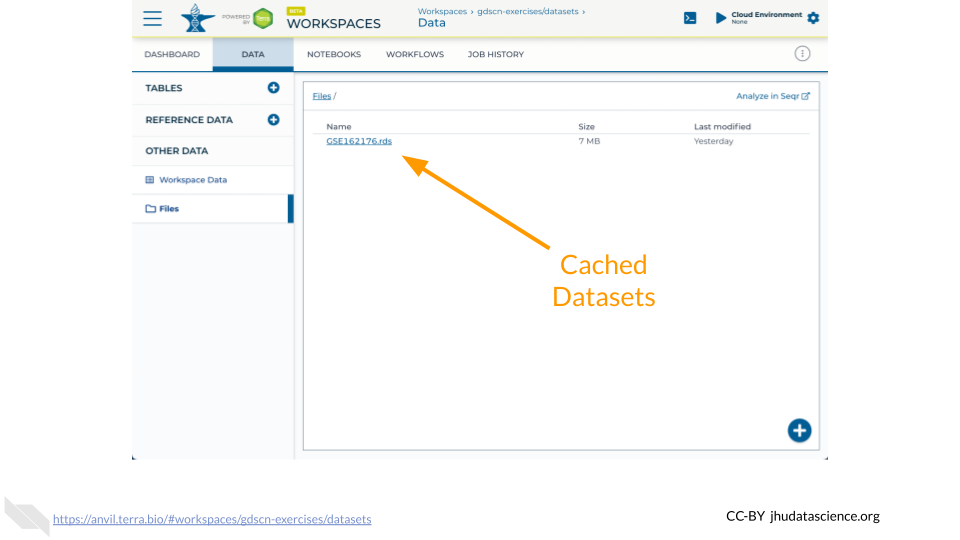
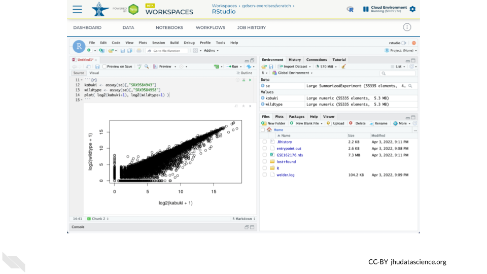
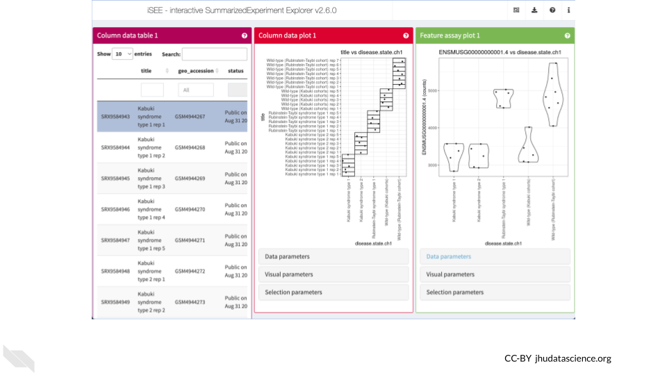

# (PART\*) RNASEQ PREPARATION {-}

# Data Exploration

## About the Data

Mendelian disorders of the epigenetic machinery (MDEMs) are a relatively new group of multiple congenital anomaly and intellectual disability syndromes. These disorders result from mutations in genes responsible for epigenetic machinery. In other words, genes responsible for controlling the [epigenome](https://youtu.be/_aAhcNjmvhc) lose their normal function.

Despite having different causative genes, these disorders share similarities in disease presentation. This physical similarity, or phenotypic convergence, could be due to these mutations causing similar effects at the epigenomic level. Such epigenetic changes then lead to similarities gene expression.

Scientists at Johns Hopkins designed an experiment to identify abnormalities shared across multiple MDEMs, in order to causally relate epigenetic variation to disease phenotypes. As part of this experiment, scientists examined gene expression (RNA-Seq) states from mouse models of three MDEMs (Kabuki types 1&2 and Rubinstein-Taybi syndromes).

You can find out more about this experiment [here](https://www.ncbi.nlm.nih.gov/geo/query/acc.cgi?acc=GSE162176).


## Using `GEOquery`

The [NCBI Gene Expression Omnibus (GEO)](https://www.ncbi.nlm.nih.gov/geo/) is an international public repository that archives and freely distributes microarray, next-generation sequencing, and other forms of high-throughput functional genomics data submitted by the research community. We will use the Bioconductor package [`GEOquery`](https://bioconductor.org/packages/release/bioc/html/GEOquery.html) to load data from GEO. 

Using `GEOquery` is convenient because it allows us to get the data programmatically without having to download anything manually. This ensures anyone following in our footsteps can follow what we did exactly.

First, install `GEOquery` and load the library using the following code. if you are asked to update packages, you can type 'n' for 'no'.


```r
# Install and load GEOquery
BiocManager::install("GEOquery")
library(GEOquery)
```

## `GEOquery` Record Types

GEO contains [several different record types](https://www.ncbi.nlm.nih.gov/geo/info/overview.html). The most straightforward is a 'Sample' record. A Sample record describes the conditions under which an individual Sample was handled, the manipulations it underwent, and the abundance measurement of each element derived from it. Each Sample record is assigned a unique and stable GEO accession number (GSMxxx). A Sample entity may be included in multiple 'Series'. 

a 'Series' record defines a set of related Samples considered to be part of a group. This record describes how the Samples are related and provides information about the experiment. Series records may also contain tables describing extracted data, summary conclusions, or analyses. Each Series record is assigned a unique and stable GEO accession number (GSExxx).

We need to locate the correct 'Series' number for this experiment.


## Kabuki Dataset Metadata

We will use the `getGEO()` function to locate the experiment's data using the Series record number. 


```r
# Indicate which Series to download
gse <- getGEO("GSE162176")
```

The output from `getGEO()` on a Series record type is a list of objects called an `ExpressionSet`. In our case, there is only one ExpressionSet, so we can select the first item (the data) from the list using brackets.


```r
# Select the first item in the list
exp_set <- gse[[1]]
```

We can look at the ExpressionSet metadata using `pData()`.


```r
# Extract phenotypic data
pheno_data <- pData(exp_set)
names(pheno_data)
```

```
##  [1] "title"                   "geo_accession"          
##  [3] "status"                  "submission_date"        
##  [5] "last_update_date"        "type"                   
##  [7] "channel_count"           "source_name_ch1"        
##  [9] "organism_ch1"            "characteristics_ch1"    
## [11] "characteristics_ch1.1"   "characteristics_ch1.2"  
## [13] "characteristics_ch1.3"   "molecule_ch1"           
## [15] "extract_protocol_ch1"    "extract_protocol_ch1.1" 
## [17] "taxid_ch1"               "description"            
## [19] "data_processing"         "data_processing.1"      
## [21] "data_processing.2"       "platform_id"            
## [23] "contact_name"            "contact_email"          
## [25] "contact_laboratory"      "contact_department"     
## [27] "contact_institute"       "contact_address"        
## [29] "contact_city"            "contact_state"          
## [31] "contact_zip/postal_code" "contact_country"        
## [33] "data_row_count"          "instrument_model"       
## [35] "library_selection"       "library_source"         
## [37] "library_strategy"        "relation"               
## [39] "relation.1"              "supplementary_file_1"   
## [41] "age (approximate):ch1"   "cell type:ch1"          
## [43] "disease state:ch1"       "strain:ch1"
```

View the data to see which Samples are contained in this ExpressionSet.


```r
# Explore the metadata
View(pheno_data)
```


```
##                                   title geo_accession                status
## GSM4944267 Kabuki syndrome type 1 rep 1    GSM4944267 Public on Aug 31 2021
## GSM4944268 Kabuki syndrome type 1 rep 2    GSM4944268 Public on Aug 31 2021
## GSM4944269 Kabuki syndrome type 1 rep 3    GSM4944269 Public on Aug 31 2021
## GSM4944270 Kabuki syndrome type 1 rep 4    GSM4944270 Public on Aug 31 2021
## GSM4944271 Kabuki syndrome type 1 rep 5    GSM4944271 Public on Aug 31 2021
##            submission_date last_update_date type
## GSM4944267     Nov 25 2020      Aug 31 2021  SRA
## GSM4944268     Nov 25 2020      Aug 31 2021  SRA
## GSM4944269     Nov 25 2020      Aug 31 2021  SRA
## GSM4944270     Nov 25 2020      Aug 31 2021  SRA
## GSM4944271     Nov 25 2020      Aug 31 2021  SRA
```

The GEO record provides information about each of the samples (aka "metadata").  You can use the `table()` function to tabulate how many samples there are for each of the three disease states (along with their corresponding wild type controls).


```r
table( pheno_data$`disease state:ch1` )
```

```
## 
##              Kabuki syndrome type 1              Kabuki syndrome type 2 
##                                   5                                   5 
##    Rubinstein-Taybi syndrome type 1          Wild-type (Kabuki cohorts) 
##                                   5                                   5 
## Wild-type (Rubinstein-Taybi cohort) 
##                                   7
```

::: {.fyi}
QUESTIONS:

1. What was the cell type (`cell type:ch1`) used in this experiment?
2. Which column contains information about the ages?
3. Which age has the most samples?
:::

## Pull in counts

Retrieving GSE162176 using `getGEO()` currently does not obtain RNA-seq expression data.  We have cached a `SummarizedExperiment` object in the [GDSCN datasets](https://anvil.terra.bio/#workspaces/gdscn-exercises/datasets) Workspace.  This object contains metadata, counts, and abundance information as produced by the [nf-co.re/rnaseq/3.6](https://nf-co.re/rnaseq/3.6) pipeline using the [GENCODE M23](https://www.gencodegenes.org/mouse/release_M23.html) annotation.



The Bioconductor [AnVIL package](http://bioconductor.org/packages/AnVIL) provides a `gsutil_cp()` function to streamline transfers between AnVIL Workspaces.  Note that the [syntax for accessing Google Cloud Storage resources](https://cloud.google.com/storage/docs/gsutil#syntax) is `gs://BUCKET_NAME/OBJET_NAME`, and that each AnVIL Workspace has an associated bucket.  The following command transfers the `GSE162176.rds` file from the GDSCN datasets Workspace into your Workspace.


```r
AnVIL::gsutil_cp( "gs://fc-8529d29f-ac62-4c10-9f01-14f4d7612ae0/GSE162176.rds", "." )
```

Once you have obtained a copy of the `.rds` file, load it into your environment using the `readRDS()` function.  Note that you will need to install the [SummarizedExperiment](http://bioconductor.org/packages/SummarizedExperiment) package if you have not previously done so.


```r
AnVIL::install( "SummarizedExperiment" )
se <- readRDS( "GSE162176.rds" )
```

Confirm that you have successfully loaded the data by creating a scatterplot comparing a Kabuki sample and a Wild-type sample.


```r
kabuki <- assay(se)[,"SRX9584943"]
wildtype <- assay(se)[,"SRX9584958"]
plot( log2(kabuki+1), log2(wildtype+1) )
```



::: {.fyi}
QUESTIONS:

4. Which SRX accession numbers correspond to Rubinstein-Taybi?
5. Create a scatterplot comparing a Rubinstein-Taybi sample and a Wild-type sample
:::

## Explore in iSEE

The Bioconductor [Interactive SummarizedExperiment Explorer (iSEE)](https://bioconductor.org/packages/iSEE) provides an interactive Shiny-based graphical user interface for exploring data stored in SummarizedExperiment objects and it's extensions such as SingleCellExperiment.  One feature that we will use here is the ability to explore what experimental conditions are present in this dataset and how gene expression changes between conditions.



You can launch an interactive explorer simply by calling the `iSEE()` function with only a SummarizedExperiment object.  However, you can also configure the explorer by passing additional parameters such as the types of panels that you wish to appear.  Here we launch iSEE with panels allowing exploration of the sample metadata as a table, the sample metadata as a plot, and the gene expression data as a plot.  Note that you will need to install the iSEE package if you have not previously done so.


```r
AnVIL::install( "iSEE" )
library( "iSEE" )
iSEE( se, list( ColumnDataTable(), ColumnDataPlot(), FeatureAssayPlot() ) )
```

::: {.fyi}
QUESTIONS:

6. In the "Column data plot" panel, create a plot with age on the y-axis and disease on the x-axis.  Which disease states have the most age diversity?  The least?
7. In the "Feature assay plot" panel, create a plot with ENSMUSG00000000001.4 on the y-axis and disease on the x-axis.  What conclusions can you make if you plot counts?  Does it change if you plot abundance?
:::


```r
sessionInfo()
```

```
## R version 4.1.3 (2022-03-10)
## Platform: x86_64-pc-linux-gnu (64-bit)
## Running under: Ubuntu 20.04.5 LTS
## 
## Matrix products: default
## BLAS:   /usr/lib/x86_64-linux-gnu/openblas-pthread/libblas.so.3
## LAPACK: /usr/lib/x86_64-linux-gnu/openblas-pthread/liblapack.so.3
## 
## locale:
##  [1] LC_CTYPE=en_US.UTF-8       LC_NUMERIC=C              
##  [3] LC_TIME=en_US.UTF-8        LC_COLLATE=en_US.UTF-8    
##  [5] LC_MONETARY=en_US.UTF-8    LC_MESSAGES=en_US.UTF-8   
##  [7] LC_PAPER=en_US.UTF-8       LC_NAME=C                 
##  [9] LC_ADDRESS=C               LC_TELEPHONE=C            
## [11] LC_MEASUREMENT=en_US.UTF-8 LC_IDENTIFICATION=C       
## 
## attached base packages:
## [1] stats     graphics  grDevices utils     datasets  methods   base     
## 
## other attached packages:
## [1] GEOquery_2.62.2     Biobase_2.54.0      BiocGenerics_0.40.0
## 
## loaded via a namespace (and not attached):
##  [1] bslib_0.3.1         compiler_4.1.3      pillar_1.7.0       
##  [4] BiocManager_1.30.16 jquerylib_0.1.4     highr_0.9          
##  [7] R.methodsS3_1.8.1   R.utils_2.12.2      tools_4.1.3        
## [10] digest_0.6.29       jsonlite_1.8.0      evaluate_0.15      
## [13] lifecycle_1.0.1     tibble_3.1.6        pkgconfig_2.0.3    
## [16] png_0.1-7           rlang_1.0.2         DBI_1.1.2          
## [19] cli_3.2.0           curl_4.3.2          yaml_2.3.5         
## [22] xfun_0.26           fastmap_1.1.0       xml2_1.3.3         
## [25] dplyr_1.0.8         stringr_1.4.0       httr_1.4.2         
## [28] knitr_1.33          generics_0.1.2      fs_1.5.2           
## [31] vctrs_0.4.1         sass_0.4.1          hms_1.1.1          
## [34] tidyselect_1.1.2    data.table_1.14.2   glue_1.6.2         
## [37] R6_2.5.1            fansi_1.0.3         ottrpal_1.0.1      
## [40] rmarkdown_2.10      bookdown_0.24       limma_3.50.3       
## [43] tidyr_1.2.0         purrr_0.3.4         readr_2.1.2        
## [46] tzdb_0.3.0          magrittr_2.0.3      ellipsis_0.3.2     
## [49] htmltools_0.5.2     assertthat_0.2.1    utf8_1.2.2         
## [52] stringi_1.7.6       crayon_1.5.1        R.oo_1.24.0
```
