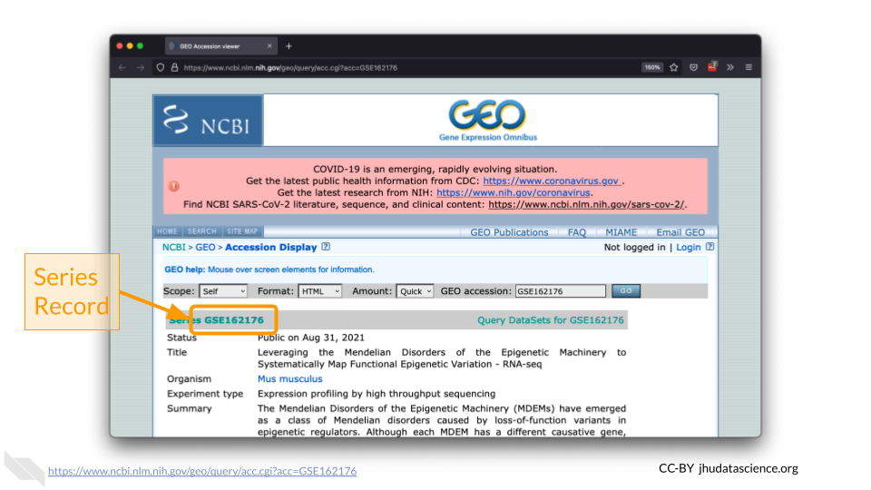

# (PART\*) RNASEQ PREPARATION {-}

# Data Exploration

## About the Data

Mendelian disorders of the epigenetic machinery (MDEMs) are a relatively new group of multiple congenital anomaly and intellectual disability syndromes. These disorders result from mutations in genes responsible for epigenetic machinery. In other words, genes responsible for controlling the [epigenome](https://youtu.be/_aAhcNjmvhc) lose their normal function.

Despite having different causative genes, these disorders share similarities in disease presentation. This physical similarity, or phenotypic convergence, could be due to these mutations causing similar effects at the epigenomic level. Such epigenetic changes then lead to similarities gene expression.

Scientists at Johns Hopkins designed an experiment to identify abnormalities shared across multiple MDEMs, in order to causally relate epigenetic variation to disease phenotypes. As part of this experiment, scientists examined gene expression (RNA-Seq) states from mouse models of three MDEMs (Kabuki types 1&2 and Rubinstein-Taybi syndromes).

You can find out more about this experiment [here](https://www.ncbi.nlm.nih.gov/geo/query/acc.cgi?acc=GSE162176).


## Using `GEOquery`

The [NCBI Gene Expression Omnibus (GEO)](https://www.ncbi.nlm.nih.gov/geo/) is an international public repository that archives and freely distributes microarray, next-generation sequencing, and other forms of high-throughput functional genomics data submitted by the research community. We will use the Bioconductor package [`GEOquery`](https://bioconductor.org/packages/release/bioc/html/GEOquery.html) to load data from GEO. 

Using `GEOquery` is convenient because it allows us to get the data programmatically without having to download anything manually. This ensures anyone following in our footsteps can follow what we did exactly.

First, install `GEOquery` and load the library using the following code. if you are asked to update packages, you can type 'n' for 'no'.


```r
# Install and load GEOquery
BiocManager::install("GEOquery")
library(GEOquery)
```

## `GEOquery` Record Types

GEO contains [several different record types](https://www.ncbi.nlm.nih.gov/geo/info/overview.html). The most straightforward is a 'Sample' record. A Sample record describes the conditions under which an individual Sample was handled, the manipulations it underwent, and the abundance measurement of each element derived from it. Each Sample record is assigned a unique and stable GEO accession number (GSMxxx). A Sample entity may be included in multiple 'Series'. 

a 'Series' record defines a set of related Samples considered to be part of a group. This record describes how the Samples are related and provides information about the experiment. Series records may also contain tables describing extracted data, summary conclusions, or analyses. Each Series record is assigned a unique and stable GEO accession number (GSExxx).

We need to locate the correct 'Series' number for this experiment.



## Kabuki Dataset Metadata

We will use the `getGEO()` function to locate the experiment's data using the Series record number. 


```r
# Indicate which Series to download
gse <- getGEO("GSE162176")
```

The output from `getGEO()` on a Series record type is a list of objects called an `ExpressionSet`. In our case, there is only one ExpressionSet, so we can select the first item (the data) from the list using brackets.


```r
# Select the first item in the list
exp_set <- gse[[1]]
```

We can look at the ExpressionSet metadata using `pData()`.


```r
# Extract phenotypic data
pheno_data <- pData(exp_set)
names(pheno_data)
```

```
##  [1] "title"                   "geo_accession"          
##  [3] "status"                  "submission_date"        
##  [5] "last_update_date"        "type"                   
##  [7] "channel_count"           "source_name_ch1"        
##  [9] "organism_ch1"            "characteristics_ch1"    
## [11] "characteristics_ch1.1"   "characteristics_ch1.2"  
## [13] "characteristics_ch1.3"   "molecule_ch1"           
## [15] "extract_protocol_ch1"    "extract_protocol_ch1.1" 
## [17] "taxid_ch1"               "description"            
## [19] "data_processing"         "data_processing.1"      
## [21] "data_processing.2"       "platform_id"            
## [23] "contact_name"            "contact_email"          
## [25] "contact_laboratory"      "contact_department"     
## [27] "contact_institute"       "contact_address"        
## [29] "contact_city"            "contact_state"          
## [31] "contact_zip/postal_code" "contact_country"        
## [33] "data_row_count"          "instrument_model"       
## [35] "library_selection"       "library_source"         
## [37] "library_strategy"        "relation"               
## [39] "relation.1"              "supplementary_file_1"   
## [41] "age (approximate):ch1"   "cell type:ch1"          
## [43] "disease state:ch1"       "strain:ch1"
```

View the data to see which Samples are contained in this ExpressionSet.


```r
# Explore the metadata
View(pheno_data)
```


```
##                                   title geo_accession                status
## GSM4944267 Kabuki syndrome type 1 rep 1    GSM4944267 Public on Aug 31 2021
## GSM4944268 Kabuki syndrome type 1 rep 2    GSM4944268 Public on Aug 31 2021
## GSM4944269 Kabuki syndrome type 1 rep 3    GSM4944269 Public on Aug 31 2021
## GSM4944270 Kabuki syndrome type 1 rep 4    GSM4944270 Public on Aug 31 2021
## GSM4944271 Kabuki syndrome type 1 rep 5    GSM4944271 Public on Aug 31 2021
##            submission_date last_update_date type
## GSM4944267     Nov 25 2020      Aug 31 2021  SRA
## GSM4944268     Nov 25 2020      Aug 31 2021  SRA
## GSM4944269     Nov 25 2020      Aug 31 2021  SRA
## GSM4944270     Nov 25 2020      Aug 31 2021  SRA
## GSM4944271     Nov 25 2020      Aug 31 2021  SRA
```

## Recap

:::{.fyi}
QUESTION:

Explore the metadata. What was the cell type (`cell type:ch1`) used in this experiment?
:::


```r
sessionInfo()
```

```
## R version 4.0.2 (2020-06-22)
## Platform: x86_64-pc-linux-gnu (64-bit)
## Running under: Ubuntu 20.04.3 LTS
## 
## Matrix products: default
## BLAS/LAPACK: /usr/lib/x86_64-linux-gnu/openblas-pthread/libopenblasp-r0.3.8.so
## 
## locale:
##  [1] LC_CTYPE=en_US.UTF-8       LC_NUMERIC=C              
##  [3] LC_TIME=en_US.UTF-8        LC_COLLATE=en_US.UTF-8    
##  [5] LC_MONETARY=en_US.UTF-8    LC_MESSAGES=C             
##  [7] LC_PAPER=en_US.UTF-8       LC_NAME=C                 
##  [9] LC_ADDRESS=C               LC_TELEPHONE=C            
## [11] LC_MEASUREMENT=en_US.UTF-8 LC_IDENTIFICATION=C       
## 
## attached base packages:
## [1] parallel  stats     graphics  grDevices utils     datasets  methods  
## [8] base     
## 
## other attached packages:
## [1] GEOquery_2.58.0     Biobase_2.50.0      BiocGenerics_0.36.1
## 
## loaded via a namespace (and not attached):
##  [1] pillar_1.4.6        compiler_4.0.2      BiocManager_1.30.10
##  [4] jquerylib_0.1.4     highr_0.8           tools_4.0.2        
##  [7] digest_0.6.25       evaluate_0.14       lifecycle_1.0.0    
## [10] tibble_3.0.3        pkgconfig_2.0.3     png_0.1-7          
## [13] rlang_0.4.10        cli_2.0.2           curl_4.3           
## [16] yaml_2.2.1          xfun_0.26           httr_1.4.2         
## [19] stringr_1.4.0       dplyr_1.0.2         knitr_1.33         
## [22] xml2_1.3.2          generics_0.0.2      fs_1.5.0           
## [25] vctrs_0.3.4         hms_0.5.3           tidyselect_1.1.0   
## [28] glue_1.6.1          R6_2.4.1            fansi_0.4.1        
## [31] ottrpal_0.1.2       rmarkdown_2.10      bookdown_0.24      
## [34] limma_3.46.0        readr_1.4.0         purrr_0.3.4        
## [37] tidyr_1.1.2         magrittr_2.0.2      ellipsis_0.3.1     
## [40] htmltools_0.5.0     assertthat_0.2.1    stringi_1.5.3      
## [43] crayon_1.3.4
```
